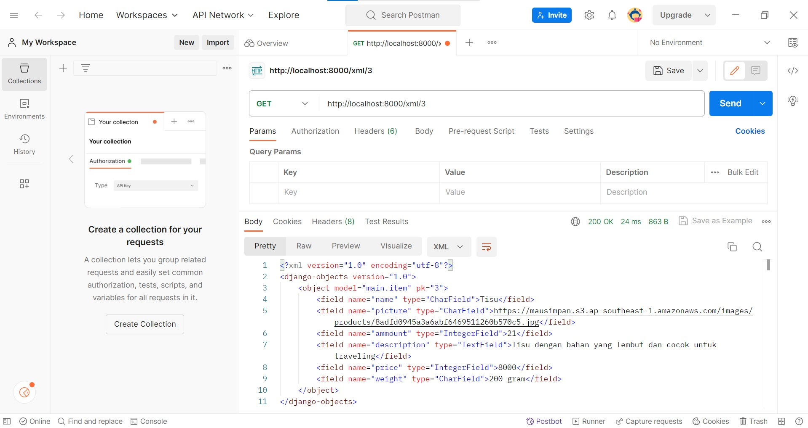

Nama : Catherine Hana Natalie

NPM : 2206083123

Kelas : PBP B

Link Adaptable: https://hanagrosir.adaptable.app/main/

========================================== Tugas PBP 4 ==================================================

1. Apa itu Django UserCreationForm, dan jelaskan apa kelebihan dan kekurangannya?

Django adalah framework web Python yang ada untuk memudahkan pembuatan user baru dalam aplikasi web yang kita kembangkan. Django UserCreationForm adalah sebuah formulir yang disediakan oleh Django. formulir ini dirancang untuk mengelola proses pendaftaran user dan menciptakan objek "User" dalam basis data website yang kita kembangkan. Formulir ini digunakan dalam kombinasi dengan modul "django.contrib.auth" yang membuat kita mampu untuk mengelola otoritasi dan autentikasi user.

Berikut adalah kelebihan dari Django UserCreationForm"

- Validasi otomatis: Saat user memberikan masukan atau input, formulir (form) ini akan melakukan validasi otomatis sehingga kita dapat memastikan bahwa data user yang dimasukkan sesuai dengan kebutuhan. Contohnya adalah saat user memasukkan input email, maka email harus unik.
- Mudah digunakan: Formulir ini sudah disediakan oleh Django dan sudah diintegrasikan dengan baik dalam kerangka kerja, sehingga kita tidak perlu membuatnya dari awal lagi.
- Integrasi dengan basis data: Formulir ini dapat mengambil data user diinput dan menyimpannya ke dalam basis data. FOrmulir ini juga bisa membuat user baru tanpe perlu menulis kode SQL atau berinteraksi secara langsung dengan basis data.
- Mudah di custom: UserCreationForm dapat kita ubah sesuai dengan kebutuhan aplikasi kita, misalnya dengna menambahkan atau menghapus bidang-bidang tambahan atau melakukan validasi tambahan.

Berikut Kekurangan dari UserCreationForm:

- Tidak terlalu fleksibel: Bisa saja aplikasi kita tidak cocok sepenuhnya dengan struktur yang disediakan oleh UserCreationForm. Dalam kasus ini, Kita perlu menulis formulir pendaftaran yang sudah kita sesuaikan.
- Fitur yang terbatas" Dalam beberapa kasus, kita mungkin memerlukan formulir pendaftaran yang lebih kompleks dengan bidang tambahan, seperti data profil user. Dalam hal ini, kita perlu menyesuaikan formulir atau membuat formulir khusus
- Tampilan bawaan formulir sederhana: Formulir hanya memberikan tampilan sederhana untuk pendaftaran user. Kita perlu UserCreationForm dengan HTML dan CSS khusus jika kita mau memiliki tampilan formulir yang menarik atau kompleks.

2. Apa perbedaan antara autentikasi dan otorisasi dalam konteks Django, dan mengapa keduanya penting?

Autentikasi adalah proses memvetivikasi identitas user yang mencoba untuk mengakses sistem. Otorisasi adalah suatu batasan untuk mengakses bagian menu tertentu pada sistem informasi. Otoriasi menentukan apa saja yang dapat dilakukan oleh user di dalam sistem. Proses otorisasi terjadi setelah proses autentikasi Berikut adalah perbedaan antara autentikasi dan otorisasi:

- Prinsip
  - Autentikasi: berguna sebagai alat untuk melakukan verifikasi data pengguna dalam memberikan izin kepada sistem.
  - Otorisasi: penentuan tentang siapa saya yang dapat atau harus mengakses menu apa saja
- Proses
  - Autentikasi: Di sini, user yang diverifikasi
  - Otorisasi: Di sini daftar pada akses user yang di validasi
- Urutan proses
  - Autentikasi: Proses ini pertama berjalan
  - Otoritasi: Proses ini terjadi setelah dilakukan proses autentikasi
- Penentu akses
  - Autentikasi: Pada proses ini, identitas seseorang ditentukan dari data yang menggunakan bantuan ID user serta kata sandi mereka
  - Otorisasi: Pada proses ini, sistem otorisasi yang memutuskan hak akses yang dimiliki oleh tiap user

Otorisasi sangat penting dalam konteks Django karena proses ini memastikan bahwa user hanya dapat melakukan tindakan atau memiliki akses yang diizinkan oleh sistem. Hal ini akan mencegah pengguna melakukan tindakan yang tidak diizinkan, misalnya pengguna tidak diizinkan untuk mengganti tampilan html dan css dari semua websitenya. Autentikasi penting di kontek Django karena proses ini memastikan bahwa hanya user yang sah yang dapat mengakses sitem, misalnya dengan memasukkan user dan kata sandi yang benar. Kedua sistem ini penting karena dapat menjaga keamanan sistem, membantu memenuhi kewajiban untuk melindungi akses ke data-data sensitif, dan membantu mengelola akses yang dapat mencegah penyalahgunaan akses.

3. Apa itu cookies dalam konteks aplikasi web, dan bagaimana Django menggunakan cookies untuk mengelola data sesi pengguna?

Dalam konteks aplikasi web, cookies adalah file teks kecil yang disimpan di sisi client(browser) saat kita mengunjungi sebuah situs web. Cookies ini akan digunakan untuk menyimpan informasi dan data tertentu yang berkaitan dengan interaksi user dengan situs web yang dikunjungi. Django menggunakan cookies untuk mengelolas data sesi user. Django menyediakan dukungan penuh untuk sesi anonim. Berikut cara Django menggunakan cookies:

- Identifikasi pengguna: server Django membuat cookie yang unik dan mengirimkannya ke browser user saat user pertama kali mengungjungi situs web tersebut. Cookie ini berisi informasi yang membantu server mengidentifikasi user tertentu ketika mereka kembali ke situs web
- Penyimpanan data sesi: Django menggunakan cookies untuk menyimpan data sesi user. Ada suatu bagian yang disebut session ID, ini akan disimpan dalam cookie. Data sesi yang sesungguhnya tidak disimpan di cookie tetapi disimpah di server Django. Cookie hanya berfungsi sebagai referensi ke sesi ayng sesungguhnya di server
- Keamanan: Django memiliki mekanisme keamanan bawaan yang memungkinkan kita untuk melindungi cookies dari serangan, seperti peretasan lintas situs
- Pengaturan cookies: Django akan memberikan pengembang situs web kendali penuh atas pengelolaan cookies. Kita dapat mengatur apakah cookies perlu dienkripsi, durasi berlakunnya cookies, dll.
- Kustomisasi: Kita dapat mengatur atau mengkustmisasi penggunaan cookies dalam Django sesuai dengan kebutuhan kita.

Kita akan perlu mengaktifkan django.contrib.sessions.middleware.SessionMiddleware dan mengonfigurasikan pengaturan sesi di file settings.py jika kita ingin mengelola sesi user menggunakan cookies. Django akan secara otomatis mengelola cookie sesi untuk kita dan mengizinkan kita untuk menyimpan dan mengakses data sesi user dengan mudal dalam kode aplikasi kita

4. Apakah penggunaan cookies aman secara default dalam pengembangan web, atau apakah ada risiko potensial yang harus diwaspadai?

Umumnya, penggunaan cookies dalam pengembangan web memiliki banyak manfaat, tetapi ada juga beberapa risiko potensial yang harus diwaspadai. Keamanan cookies tergantung dengan bagaimana kita menggunakan dan mengelola cookies tersebut. Berikut adalah beberapa risiko potensial yang harus diwaspadai:

- Penyalahgunaan cookies: Cookies dapat disalahgunakan oleh penyerang untuk mengakses atau mencuri informasi sensitif. Oleh karena itu, sangat penting untuk mengenkripsi data sensitif dalam cookies dan mengimplementasikan praktiks kemanan yang tepat
- Serangan Cross-Site Request Forgery (CSRF): Cookies dapat digunakan dalam serangan CSRF. Di sini penyerang memaksa user yang sudah terautentikasi untuk melakukan tindakan yang tidak diinginkan tanpe sepengetahuan user. Untuk mengatasi risiko ini, kita perlu mengimplementasikan perlindungan CSRF
- Pelanggaran privasi user: Cookies dapat digunakan untuk melacak aktivitas user tanpa persetujuan mereka, dan ini melanggar privasi user. Oleh karena itu, UU dan peraturan perlindungan data mengatur penggunaan cookies dan mengharuskan perusahaan untuk mendapatkan izin atau persetujuan dari user sebelum melacak data mereka
- Serangan Cross-Ste Scripting(XSS): Jika data yang disimpan dalam cookies tidak divalidasi atau di-filter dengna baik, maka cookies dapat menjadi target serangan XSS. Penyerang dapat mencoba menyisipkan skrip berbahaya ke dalam cookie user dan menyebabkan eksekusi skrp berbahaya saat cookie dibaca. Maka dari itu, sangan penting untuk seslau memvalidasi dan memberishkan daya sebelum memasukkannya ke dalam cookie
- Kerentanan terhadap peretas: Jika cookies tidak diamankan dengan baik, peretas dapat memanfaatkan ini dam menyerang kita. Ini termasuk penggunaan algoritma enkripsi yang lemah atau mengirim data sensitif dalam teks terbuka.

5. Jelaskan bagaimana cara kamu mengimplementasikan checklist di atas secara step-by-step (bukan hanya sekadar mengikuti tutorial).

- Menjalankan virtual environment
- Menambahkan import redirect, UserCreationForm, dan messages pada bagian paling atas file views di main
- Membuat fungsi register yang menerima parameter request yang menghasilkan formulir registrasi secara otomatis dan menghasilkan akun user ketika data di-submit dati form
- Saat user melakukan register, fungsi ini akan redirect user ke laman login setelah data form berhasil di simpan
- Membuat file register.html di folder templates di main yang berisikan format html untuk menu register
- Menambahkan impor fungsi register di urls.py dan menambahkan path url ke dalam urlpatterns untuk mengakses fungsi register
- Membuat fungsi dengan nama login_user yang menerima parameter request dengan cara membuka views.py
- Di views.py, kita import authenticate dan login di bagian paling atas
- Menambahkan kode untuk fungsi login, di sini akan ada kode untuk autentikasi user
- Membuat berkas HTML baru dengan nama login.html pada folder templates d main
- Menambahkan kode untuk format tampilan website saat login di file tersebut
- Memasukkan kode import ke dalam file urls.py di main dan menambahkan path url ke dalam urlpatterns untuk mengakses fungsi login_user
- Membuat fungsi logout_user di views.py dalam main dengan parameter request
- Import logout di paling atas dan menambahkan kode untuk mekanisme logout di dalam fungsi logout_user tadiyang akan mengarahkan pengguna ke halaman login di Django
- Menambahkan kode html untuk menunjukkan button logout di file main.html
- Melakukan import fungsi logout_user di urls.py pada main dan menambahkan path url ke dalam urlpatterns untuk mengakses fungsi logout_user
- Membuat 2 akun dengan cara register terlebih dahulu
- Memasukkan data add new product sebanyak 3 kali untuk masing-masing akun di laman website
- Menghubungan model Item dengan User sehingga user yang sedang terotoritasi hanya melihat produk-produk yang telah dibuat sendiri
- Memasukkan kode import User di file models.py di main untuk mengimport model
- Menambahkan kode pada model Item untuk menghubungkan satu item dengan satu user melalui relationship
- Mengubah kode pada fungsi create_product di file views.py di main untuk mencegah Django agar tidak langsung menyimpan objek ke dalam database sehingga kita masih bisa memodifikasinya sebelum mensubmit form
- Mengubah kode di fungsi show_main untuk menampilkan object Item yang terasosiakan dengan user yang sedan login dan username pengguna yang sedang login pada halaman main
- Menyimpan semua perubahan
- Melakukan migrasi model dengan python manage.py makemigrations dan memberikan input sebanyak 2 kali. Ini untuk menetapkan default value field user pada semua row yang telah dibuat pada basis data dan menetapkan user dengan ID 1 pada model Item
- Melakukan python manage.py migrate untuk mengaplikasikan migrasi yang telah dilakukan
- Mengimport login_required di file views.py pada main
- Menambahkan kode @login_required(login_url='/login') di atas fungsi show_main agar halaman main hanya dapat diakses oleh pengguna yang sudah login
- Melakukan logout di web jika kita pernah login
- Mengimport HttpResponseRedirect, reverse, dan datetime di file views.py pada main
- Menambahkan fungsi untuk menambahkan cookies bernama last_login di fungsi login_user untuk melihat kapan terakir kali user melakukan login
- Menambahkan kode 'last_login': request.COOKIES['last_login'] ke dalam variabel context di fungsi show_main untuk menambahkan informasi cookie last_login ke web
- Mengubah fungsi logout_user untuk menghapus cookie last_login saat pengguna logout
- Membuat file main.html dan menambahkan kode html untuk menunjukkan data last_login
- Jika kita ingin melihat data cookie last_login kita dapat menakses fitur inspect elemen dan membuka bagian application.storage. Klik bagian cookes dan kita dapat melihat data cookies yang tersedia
- Menjalankan proyek Django dengan perinta python manage.py runserver dan membuka localhost

========================================= Selesai Tugas PBP 4 ===========================================

===================================== Tugas PBP 3 =======================================================

1. Apa perbedaan antara form POST dan form GET dalam Django?
   Django adalah framework web yang biasanya digunakan untuk mengembangkan aplikasi web dengan bahasa pemrograman Python. Di sini, kita dapat menggunakan metode HTTP POST dan GET untuk mengirimkan data antara server web dengan browser klien. Ini adalah perbedaan dari form POST dan form Get:

   - Tujuan,

     - Form POST: Biasa digunakan untuk mengirimkan data yang akan disimpan dan diproses oleh server.
     - Form GET: Biasa digunakan untuk mengambil data dari server tanpa memengaruhi atau mengubah data di server

   - Kemananan,

     - Form POST: Data yang dikirim akan dikirim secara tersembunyi ke server. Ini membuat proses lebih aman digunakan untuk mengirim data sensitif, seperti informasi pribadi atau kata sandi. Data-data yang dikirim juga tidak terlihat di URL
     - Form GET: Data yang dikirim akan dikirim sebagai parameter URL. Ini dilakukan agar terlihat di URL. Berbeda dengan POST, GET tidak aman untuk mengirim data sensitif

   - Batasan panjang data,

     - Form POST: Tidak memiliki batasan panjang data yang bisa dikirim sehingga cocok untuk mengirimkan data dengan ukuran yang sangat besar
     - Form GET: Ada batasan pada panjang URL sehingga tidak disarankan untuk mengirimkan data dengan ukuran yang sangat besar

   - Tampilan URL,

     - Form POST: Di sini, parameter data tidak terlihat di URL
     - Form GET: Di sini parameter data terlihat di URL

   - Bookmarking dan caching,
     - Form POST: Di sini, data yang dikirm tidak dapat di-bookmark dan tidak disimpan di dalam cache browser
     - FORM GET: DI sini data ang dikirim dapat di-bookmark dan disimpan di dalam cache browser

2. Apa perbedaan utama antara XML, JSON, dan HTML dalam konteks pengiriman data?
   JSON, XML, dan HTML adalah format yang digunakan dalam pengiriman data di web dan aplikasi. JSON adalah singkatan dari JavaScript Object Notation. XML adalah singkatan dari eXtensible Markup Language. HTML adalah singkatan dari HyperText Markup Language. Berikut perbedaan dari ketiga format tadi:

   - Tujuan,

     - JSON: Merupakan format data yang digunakan untuk melakukan proses pertukaran data antar aplikasi. JSON mudah dibaca oleh manusia dan diproses oleh komputer
     - XML: Merupakan format data yang digunakan untuk mengatur dan menyimpan data dalam struktur hirarkis. XML biasa digunakan untuk pertukaran data yang sangat terstruktur dan dapat digunakan di platform-platform
     - HTML: Merupakan bahasa markup yang digunakan untuk membuat tampilan konten dan struktur di web. HTML bisa untuk pertukaran data tapi tidak begitu lengkap

   - Syntax,

     - JSON: Syntax yang digunakan adalah pasangan nama-nilai(key-value pairs) dalam format teks
     - XML: Syntax yang digunakan adalah tag yang mendefinisikan elemen dan atribut untuk menyusun data
     - HTML: Syntax yang digunakan adalah tag, tetapi berbeda dengan XML, fungsi di HTML adalah untuk mengatur tampilan di konten halaman web

   - Ekosistem,

     - JSON: JSON sudah menjadi format standar untuk RESTful API dan banyak bahasa pemrograman sudah memiliki dukungan bawaan untuk memproses JSON
     - XML: XML sudah memiliki dukungan luas dan banyak alat untuk memproses dan mengurai datanya
     - HTML: HTML sudah didukung oleh semua web

   - Kemudahan untuk dibaca,
     - JSON: Dengan syntax yang sederhana, JSON mudah dibaca oleh manusia
     - XML: Struktur dari XML kuat tetapi sulit dibaca oleh manusia karena syntaxnya cenderung lebih kompleks
     - HTML: HTML sudah dirancang untuk mudah dibaca oleh manusia dan untuk membuat tampilan web.

3. Mengapa JSON sering digunakan dalam pertukaran data antara aplikasi web modern?
   JSON sering digunakan dalam pertukaran data antara aplikasi web modern karena JSON memiliki banyak keunggulan yang membuatnya cocok untuk mengembangkan web saat ini. Berikut adalah keuntungan-keuntungan dari JSON:

   - JSON memiliki syntax yang sangat sederhana dan mudah dimengerti oleh manusia. Syntax dari JSON adalah key-value pairs dalam format teks, ini mirip dengan objek dalam bahasa pemrograman. Dengan kemudahannya untuk dimengerti dan dibaca, JSON membuat tim pengembangan web dapat dengan cepat memeriksa dan memahami data-data yang ditransmisi.

   - JSON mudah diproses oleh komputer. JSON sangat efisien dalam pengembangan aplikasi karena sebagian besar bahasa pemrograman sudah punya pusataka atau modul bawaan untuk mengurai JSON.

   - JSON dapat ditransmisikan dengan cepat melalui jaringan dan tidak memberikan beban yang besar atau lebi dari yang diperlukan kepada sumber daya

   - JSON dapat digunakan di berbagai platform dan bahasa pemrograman. JSON menjadi ideal untuk pertukaran data antara berbagai sistem.

   - JSON memungkinkan kita untuk menyususn data dalam hierarki yang dalam dan kompleks dengan adanya struktur data bersarang. Ini juga membuat JSON mempunya representasi data yang fleksibel

   - JSON sudah menjad standar untuk pertukaran di banyak layanan web RESTful(Representational State Transfer). API yang menggunakan JSON biasanya lebih mudah dipahami dan digunakan

   - JSON mendukung berbagai tipe dasar, seperti string, int, boolean, dll. Hal ini membuat kita untuk menggambarkan berbagai jenis data dengan mudah di JSON

   - JSON adalah bagian integral dari JavaScript sehingga JSON dapat dengan mudah diintegrasikan dengan JAvaScript. Hal ini membuat aplikasi web yang dibuat dengan bahasa JAvaScript dapat dengan mudah mengurai dan memproses data JSON

4. Jelaskan bagaimana cara kamu mengimplementasikan checklist di atas secara step-by-step (bukan hanya sekadar mengikuti tutorial).

- Membuat form sederhana untuk menginput data barang pada aplikasi dengan menambahkan kode di forms.py. Kode ini untuk membuat struktur form yang dapat menerima data produk baru. Model yang dipakai sesuai dengan tugas PBP 2, yaitu Item
- Mengisi field pada kode pembuatan forms sesuai kebutuhan. Di kasus saya ada name, price, description, picture, ammount, weight
- Membuat fungsi baru dengan nama create_product di berkas views.py dan import semua yang diperlukan. Fungsi create_product akan menerima parameter request
- Membuat ProductForm baru dengan memasukkan QueryDict berdasarkan input dari user pada requeat.POST dengan kode form = ProductForm(request.POST or None)
- Memvalidasi dan menyimpan data dan input dari form
- Memasukan kode products = Item.objects.all() pada berkas views.py di fungsi show_main untuk mengambil seluruh objek Item yang tersimpan di database
- Import fungsi create_product di berkas urls.py di main
- Menambahkan path UTL ke dalam urlpatterns di urls.py di main untuk mengakses fungsi yang sudah di-import
- Membuat berkas create_product.html, yaitu berkas html baru di folders templates pada main untuk mengatur tampilan dari web saat pengguna ingin menambahkan product baru
- Menambahkan kode  di main.html untuk menampilkan data produk dalam bentuk tabel beserta tombol "Add New Product" yang akan di redirect ke halaman form
- Membuat fungsi baru di views.py pada main. Fungsi baru tersebut bernama show_xml dan menerima parameter request. Di dalam fungsi ini juga ada variabel data untuk menyimpan hasil query dari seluruh data yang ada pada Item.
- Melakukan import HTTpResponse dan Serializer pada views.py di main
- Menambahkan retrun function berupa HTTpResponse yang berisi paramater data hasil query yang sudah diserialisasi menjadi parameter dan XML ke dalam fungsi show_xml
- Import fungsi show_xml ke urls.py di main.
- Menambahkan path url show_xml ke dalam urlpattern untuk megakses fungsi show_xml
- Membuat dungsi baru bernama show_json yang menerima parameter request dan sebuah cariabel data untuk menimpan hasil query seluruh data di Item di views.py pada main
- Menambahkan return function berupa HTTpResponse yang berisi parameter data hasi query yang sdah diserialisasi menjadi parameter dan JSON ke dalan fungsi show_json
- import fungsi show_json ke urls.py di main dan menambahkan path url show_json ke dalam urlpatterns untuk mengakses fungsi show_json
- Membuat fungsi baru yang menerima parameter request dan id dengan nama show_xml_by_id dan show_json_by_id di views.py pada main
- Membuat variabel data di dalam kedua fungsi tadi untuk meyimpan hasil query dari data dengan id tertentu yang ada pada Item
- Menambakan return function berupa HTTpResponse yang berisi parameter data dan hasil query yang sudah diserialisasi menjadi JSON atau XML dan parameter conten_type dengan value application/xml untuk format XML atau application/json untuk JSON
- Import fungsi show_xml_by_id dan show_json_by_id ke dalam urls.py di main
- Menambahkan path url show_xml_by_id dan show_json_by_id ke dalam urlpatterns untuk mengakses kedua fungsi tersebut
- Memastikan bahwa perintah python manage.py runserver sudah berjalan
- Mendownload dan membuka postman
- Membuat request baru dengan method GET dan url untuk XML atau JSON untuk mengetes apakah data terkirimkan dengan baik
- Untuk mengetes fungsi pengambilan data produk berdasarkan ID, kita bisa mengubah url dengan menambahkan "/[id]"

5. Mengakses kelima URL di poin 2 menggunakan Postman, membuat screenshot dari hasil akses URL pada Postman, dan menambahkannya ke dalam README.md
   
   
   
   
   

========================================= Selesai Tugas PBP 3 ===========================================

========================================== Tugas PBP 2 ==================================================

1. Jelaskan bagaimana cara kamu mengimplementasikan checklist di atas secara step-by-step (bukan hanya sekadar mengikuti tutorial).

- Membuat direktori baru dengan nama Hana_Grosir di direktori lokal
- Membuat repository baru dengna sifat public dan dengan nama Tugas02PBP
- Membuat dan mengaktifkan virtual environment di command prompt tempat direktori lokal tadi
- Membuat file baru dengan nama requirements.txt yang berisikan dependencies yang diperlukan
- Memasang dependencies dengan perintah di command prompt
- Membuat proyek Django bernama Hana_Grosir di command prompt
- Menambahkan ("_") pada bagian ALLOWED_HOSTS di dalam file settings.py di direktori lokal untuk deployment web. ALLOWED_HOSTS adalah daftar host yang dapat mengakses aplikasi web, dengan menambahkan ("_"), semua host dapat mengakses aplikasi.
- Menjalankan perintah untuk menjalankan server Django di command prompt
- Membuat aplikasi baru bernama main dalam proyek Hana_Grosir
- Menjalankan perintah untuk membuat aplikasi baru. Setelah ini akan ada direktori baru di dalam direktri lokal dengan nama main yang berisi struktur awal aplikasi
- Mendaftarkan aplikasi main ke dalam proyek dengan menambahkan kode "main," ke dalam variabel INSTALLED_APPS di berkan settings.py dalam drektori proyek Hana_Grosir
- Membuat routing pada proyek agar aplikasi main bisa berjalan dengan membuat berkas urls.py di dalam direktori aplikasi main. Kodenya meliput mengimport path dari django.urls untuk mendefinisikan pola url, mengimport show_main dari main.views, nama aplikasi, yaitu main pada pola url di aplikasi, dan path ke fungsi show_main
- Membuat model dalam aplikasi main dengan nama item dan memiliki atribut name, amount, description, price, dan weight di dalam file models.py di direktori aplikasi main untuk mendefinisikan model baru. Dimulai dengan meng-import models dari django.db dan membuat kelas item sebagai nama model berisi attribut tadi.
- Melakukan migrasi model dan migrasi ke dalam basis data lokal setiap melakukan perubahan di model
- Membuat fungsi show_main di file views.py dalam direktori aplikasi main untuk dikembalikan di folder templates di file main.html. Ini akan menunjukkan nama aplikasi, nama, kelas, dan isi dari aplikasinya. Ada kode return render juga untuk memunculkan file views.py di file main.html
- Membuat routing pada file urls.py di direktori aplikasi main untuk memetakan fungsi yang telah dibuat di views.py. Routing ini ada di urlpatterns dengan perintah path. Dan ada import show_main dari main.views
- Melakukan deployment ke Adaptable terhadap aplikasi main dengan cara membuat app baru, menghubungkan repository Tugas02PBP, memilih python app template sebagai template deployment, memilih PostgreSQL sebagai tipe basis data yang akan digunakan, menyesuaikan versi python saya, yaitu versi 3.10, dan pada bagian start command memasukkan perintah python manage.py migrate && gunicorn Hana_Grosir.wsgi
- Memberikan nama untuk aplikasi
- Mencentang bagian HTTP Listener on Prt dan klik Deploy App
- Menunggu sampai App berhasil di deploy

2. Buatlah bagan yang berisi request client ke web aplikasi berbasis Django beserta responnya dan jelaskan pada bagan tersebut kaitan antara urls.py, views.py, models.py, dan berkas html.
   

3. Jelaskan mengapa kita menggunakan virtual environment? Apakah kita tetap dapat membuat aplikasi web berbasis Django tanpa menggunakan virtual environment?

Virtual environment adalah sebuah alat yang digunakan dalam pengembangan proyek untuk mengisolasi dependensi dan paket-paket dalam proyek tertentu. Kita menggunakan virtual environment karena virtual environment memiliki peran-peran penting dalam mengembangkan perangkat lunak. Peran-peran penting tersebut adalah

- Keamanan,
  Dengan virtual environment, kita dapat mengontrol sumber dependensi di proyek dan mengisolasi proyek kita dari sistem operasi secara keseluruhan. Dengan mengontrol sumber dependensi kita bisa menghindari penggunaan dependesi yang tidak aman. Dengan mengisolasi proyek, kita bisa menghindari terjadinya konflik antara proyek kita dan sistem operasi yang ada.

- Isolasi dependensi,
  Virtual environtment memungkinkan kita untuk mengisolasi dependensi yang berbeda untuk proyek-proyek yang berbeda saat kita mengembangkan perangkat lunak. Bisa ada proyek-proyek tertentu yang memerlukan versi yang berbeda dari paket atau dependensi lainnya sehingga isolasi dependensi ini dapat membuat satu proyek terisolasi dengan semua yang diperlukan. Ini dapat membuat pengembangan perangkat lunak berjalan dengan lancar. Tanpa isolasi, bisa saja ada proyek yang tidak bisa berjalan di suatu versi dependensi yang digunakan.

- Pengelolaan,
  Dengan virtual environment, kita bisa menjaga proyek kita tetap teratur. Kita bisa mengelola dependensi secara terpisah dengan dependesi sistem operasi kita. Hal ini mempermudah kita dalam memperbarui, merawat, dan menghapus dependensi proyek lain tanpa memengaruhi sistem operasi kita dan dependesi lainnya.

- Kemudahan dalam mengakses,
  Dengan virtual environment, kita dapat dengan mudah membagikan proyek dengan orang lain atau memindahkannya ke sistem lain tanpa perlu khawatir tentang konflik atau persyaratan lainnya. Kita bisa membuat dan membagikan file konfigurasi yang menjelaskan dependensi proyek kita.

4. Jelaskan apakah itu MVC, MVT, MVVM dan perbedaan dari ketiganya.
   MVC, MVT, dan MVVM adalah pola arsitektur perangkat lunak yang digunakan untuk mengatur kode dalam aplikasi.

- MVC (Model-View-Controller),
  MVC adalah salah satu pola arsitektur dalam industri perangkat lunak yang paling dikenal. Pola ini memfasilitasi pemisahan perhatian dengan membagi aplikasi menjadi:

  - Model,
    Bagian ini mewakili data dan logika bisnis dalam aplikasi. Ini bertanggung jawab untuk mengelola, memproses, dan menyimpan data. Ini jga menerapkan aturan bisnis yang diperlukan
  - View,
    Bagian ini mewakili antarmuka pengguna(UI) dalam aplikasi dan lapisan presentasi, artinya bagian ini bertanggung jawab untuk menampilkan data kepada pengguna dan menanggapi input dari pengguna.
  - Controller,
    Bagian ini bertindak sebagai perantara antara tampilan dan model. Bagian ini menangani interaksi pengguna dan meneruskan permintaan di bagian view ke bagian model.

- MVT (Model-View-Template),
  Ada tiga komponen utama dalam bagian ini, yaitu:

  - Model,
    Bagian ini mewakili data dan logika bisnis dalam aplikasi. Bagian ini mirip dengan komponen model dalam MVC
  - View,
    Bagian ini bertanggung jawab dalam menangani presentasi data kepada pengguna
  - Template,
    Bagian ini bertanggung jawab dalam mengatur penampilan data dalam HTML dari sistem hingga tata caranya. Bagian ini terpisah dari view.

- MVVM(Model-View-ViewModel),
  Model ini memiliki tiga komponen utama, yaitu:
  - Model,
    Bagian ini mewakili data dan logika bisnis. Bagian ini masih sama dengan MVC dan MVT. Bagian ini bertanggung jawab dalam menyimpan dan mengambil data dan memprosesnya.
  - View,
    Bagian ini mewakili antarmuka pengguna, menampilkan data dari ViewModel dan menanggapi tindakan dari pengguna.
  - ViewModel,
    Bagian ini berfungsi sebagai jembatan antara model dan view. Bagian ini bertanggung jawab dalam mengelola logika tampilan dan menjalankan operasi untuk mengubah data sebelum ditampilkan di view.

Perbedaan:

- MVC,
  Pada pola ini, ketiga komponen utama, yaitu model, view, dan controller memiliki tanggung jawab yang jelas dan terpisah. MVC biasa digunakan untuk pengembangan aplikasi dekstop dan web. Bagian model dan view juga tidak tahu satu sama lain secara langsung, mereka hanya berkomunikasi lewat controller. Controller juga mengontrol logika aplikasi

- MVT,
  Pola ini biasanya digunakan dalam kerangka web, seperti Django di Python. Perbedaan utama terdapat dalam bagian template. Pola ini menggabungkan prinsip WVC dengan bagian template yang memisahkan tampilan dari logika sehingga tampilan dapat didefinisikan terpisah dalam file template. Ini khususnya digunakan dalam pengembangan web

- MVVN,
  Pola ini sering digunakan untuk mengembangkan aplikasi berbasis data. Pola ini mengenalkan ViewModel sebagai lapisan tambahan yang akan memisahkan tampilan dan logika dari bagian model. ViewModel mengelola tampilan secara terpusat sehingga bisa ada transformasi data sebelum ditampilkan di bagian view. Hasilnya, pengelolaan tampilan dalam menjadi lebih fleksibel. Hal inilah yang membuat pola ini sering digunakan di dalam aplikasi web modern dan berbasis mobile

========================================= Selesai Tugas PBP 2 ===========================================

1. Jelaskan manfaat dari setiap element selector dan kapan waktu yang tepat untuk menggunakannya.
   Elemen selector digunakan untuk menargetkan elemen-elemen HTML tertentu dalam halaman web kita. Berikut adalah penjelasan tentang jenis-jenis element selector:

   - Selector Elemen(Elemen Selector),

     - Manfaat: Selector elemen digunakan untuk mengedit tampilan semua elemen dengan jenis yang sama. Ini akan berguna ketika kita ingin mengaplikasikan gaya umum ke elemen-elemen tersebut. Contoh selector elemen sederhana adalah 'p' atau 'h1'
     - Waktu yang tepat: Kita bisa mengggunakan selector elemen ketika kita ingin mengedit tampilan semua elemen dengan jenis yang sama, misalnya kita ingin mengubah ukuran teks pada semua paragraf dalam halaman kita

   - Selector Kelas (Class Selector),

     - Manfaat: Selector kelas memungkinkan kita untuk mengedit tampilan elemen-elemen yang memiliki atribut 'class' yang sama. DI sini, kita dapat mengaplikasikan gaya khusus pada kelompok atau kelas tertentu
     - Waktu yang tepat: Kita dapat menggunakan selector class ketika kita ingin mengedit tampilan elemen-elemen yang memiliki karakteristik atau fungsi yang sama dengan halaman kita. Contohnya, kita ingin mengedit tampilan tombol.

   - Selector ID(ID Selector),

     - Manfaat: Selector ID digunakan untuk mengedit tampilan elemen ang memiliki atribut id unik. Ini adalah cara yang sangat spesifik untuk mengedit tampilan dan mengidentifikasi elemen tertentu
     - Waktu yang tepat: Kita dapat menggunakan selector ID saat kita perlu mengedit tampilan elemen dengan atribut id yang unik di halaman kita, seperti header, container, dll

   - Selector Universal ('\*' Selector),
     - Manfaat: Selector universal memungkinkan kita untuk mengedit tampilan semua elemen dalam halaman. Ini jarang digunakan karena akan memengaruhi semua elemen dalam halaman web, yang mungkin tidak selalu diinginkan
     - Waktu yang tepat: Kita perlu menggunakan selector universal dengan hati- hati atau bahkan menghibdari penggunaan selector universal, kecuali kita benar-benar ingin menerapkan gaya ke semua elemen dalam halaman.

2. Jelaskan HTML5 Tag yang kamu ketahui.
   HTML5 (Hypertext Markup Language versi 5) adalah versi terbaru dari standar HTML. HTML5 digunakan untuk membangun dan merancang halaman web. Ada banyak tag baru di HTML5 yang membantu pengembang web dalam membuat konten web yang lebih semantik dan kaya akan fitur. Berikut adalah beberapa tag HTMML5 yang saya ketahui:

- <header>: Tag ini digunakan untk mendefinisikan bagian atas(header) dari halam atau bagian dari konten. Ini biasanya kita gunakan untuk menempatkan logo, judul halaman, dll
- <nav>: Tag ini digunakan untuk mengelompokkan elemen-elemen yang berfungsi sebagai menu navigasi, seperti menu utama dan menu samping
- <main>: Tag ini digunakan untuk mengelompokkan konten utama dari halaman web. Kita biasanya hanya menggunakan satu elemen <main> dalam satu halaman. Ini membantu aksesibilitas
- <section>: Tag ini digunakan untuk mengelompokkan konten yang memilik makna atau topik serupa. Ini dapat membantu kita dalam memberikan struktur yang lebih baik pada halaman web
- <article>: Tag ini digunakan untuk mengelompokkan konten yang merupakan bagian independen yang dapat berdiri sendiri. COntohnya, artikel dan komentar
- <footer>: Tag ini digunakan untuk mendefinisikan bagian footer dari halaman atau bagian dari konten. Kita biasanya akan menempatkan informasi kontak dan hak cipta pada footer
- <canvas>: Tag ini digunakan untuk membuat grafik, animasi, atau gambar yang dapat diolah dengan JavaScript
- <aside>: Tag ini digunakan untuk mengelompokkan konten sampingan yang dapat berdisi sendiri, seperti sidebar dengan widget atau iklan
- <video> dan <audio>: Tag ini digunakan untuk menanamkan dan mengendalikan file video dan audio di halaman web kita
- <figure> dan <figcaption>: Tag ini digunakan bersama-sama untuk menambahkan gambar atau media lainnya berdengan dengan deskripsi. Ini membantu kita dalam merinci konten visual
- <input type='date/time/color'>: Tag ini digunakan untuk memasukkan data tanggal, waktu, atau warna dalam formulir
- <iframe>: Tag ini digunakan untuk menanamkan konten dari sumber eksternal, seperti video Youtube
- <progress> dan <meter>: Tag ini digunakan untuk menampilkan informasi mengenai kemajuan, seperti status pengiriman file
- <datalist>: Tag ini digunakan untuk membuat daftar opsi yang akan muncul saat user mulai mengetik di dalam input
- 
 dan 
: Tag ini digunakan untuk membuat konten yang dapat dijatuhkan atau diperluas, contohnya daftar isian

3. Jelaskan perbedaan antara margin dan padding.
   Margin dan padding digunakan untuk mengatur tata letak dan ruang antara elemen-elemen HTML di halaman web. Berikut adalah perbedaan antara margin dan padding

- Definisi,

  - Margin: Margin adalah jarak antara elemen dan elemen-elemen di sekitarnya di luar batas elemen tersebut
  - Padding: Padding adalah jarak antara batas elemen dan kontennya di dalam elemen tersebut

- Pengaruhnya terhadap elemen sendiri,

  - Margin: Margin memengaruhi seberapa jauh elemen tersebut dari elemen-elemen lain dari sekitarnya. Margin tidak memengaruhi tampilan atau tata letak elemen itu sendiri.
  - Padding: Padding memengaruhi tampilan elemen itu sendiri dengan menambahkan ruang di antara batas elemen dan kontennya

- Ruangan,
  - Margin: Margin memberikan ruang di luar elemen sehingga ini akan memengaruhi jarak antara elemen dan elemen-elemen lain di sekitarnya
  - Padding: Padding memberikan ruang di dalam elemen, ini memengaruhi jarak antara konten dan batas elemen

4. Jelaskan perbedaan antara framework CSS Tailwind dan Bootstrap. Kapan sebaiknya kita menggunakan Bootstrap daripada Tailwind, dan sebaliknya?
   Tailwind dan Bootstrap adalah dua framework CSS yang populer digunakan dalam pengembangan web. Berikut adalah perbedaan antara kedua framework CSS tersebut:

- Filosofi Desain,

  - Bootstrap: Bootstrap memiliki desain yang lebih baku dan sudah siap pakai. Kita bisa langsung mendapatkan komponen yang telah dirancang dengan baik yang memiliki gaya visual yang konsisten. Bootstrap menyediakan tema default yang dapat digunakan secara langsung
  - Tailwind: Taiwind lebih fleksibel dan berfokus pada 'utility first' CSS. Ini berarti kita perlu membangun desain kita sendiri dengna menggabungkan kelas-kelas utilitas CSS untuk mengatur tampilan elemen. Tailwind memberikan kita kendali lebih besar atas desain kita. Kita perlu merancang komponen kita sendiri

- Kustomisasi,

  - Bootstrap: Bootstrap memiliki opsi kustomisasi yang terbatas. Kita dapat menyesuaikan beberapa aspek tampilan dengan mengganti variabel SAss atau menggunakan alat kustomisasi online dari mereka sendiri
  - Taiwind: Tailwind sangat mudah disesuaikan. Kita dapat membuat tampilan yang benar-benar unik dengan menentukan kelas-kelas utilitas yang kita inginkan. Kita juga dapat menyesuaikan konfigurasi Tailwind secara detail

- Ukuran,

  - Bootstrap: Bootstrap memiliki ukuran yang lebih besar karena Bootstrap mengandung banyak komponen bawaan dan gaya yang sudah ada
  - Tailwing: Tailwind memiliki ukuran yang lebih kecil karena Tailwind hanya menyediakan kelas-kelas utilitas yang kita gunakan

- Kurva pembelajaran,

  - Bootstrap: Bootstrap lebih mudah untuk digunakan oleh pemula karena kita tidak perlu menulis banyak kode CSS khusus. Kita dapat mulai dengan cepat menggunakan komponen=komponen Bootstrap yang sudah ada
  - Tailwind: Untuk memahami Tailwind, kita memerlukan waktu yang lebih banyak. Biasanya Tailwind membutuhkan penulisan HTML yang lebih banyak untuk mengatur tampilan yang menggunakan kelas-kelas utilitas.

- Kasus penggunaan,
  - Bootstrap: Bootstrap sebaikan digunakan ketika kita membutuhkan desain yang siap pakai dengan gaya visual yang konsisten. Kita juga bisa memakai ini saat kita ingin membangun situs web dengan cepat tanpa banyak menuis kode yang perlu kustomisasi. Dan saat kita tidak memerlukan tingkat kustomisasi yang tinggi
  - Tailwind: Tailwind sebaiknya digunakan ketika kita membutuhkan kendali penuk atas desain kita sendiri dan ingin membuat tampulan yang unik. Kita juga bisa menggunakan ini saat kita memerlukan fleksibilitas tinggi dalam mengatur tampilan elemen-elemen dan kita nyaman dengan pemrograman kelas utilitas CSS.

5. Jelaskan bagaimana cara kamu mengimplementasikan checklist di atas secara step-by-step (bukan hanya sekadar mengikuti tutorial).

- Menambahkan Bootstrap ke dalam aplikasi dengan cara memasukkan tag dan link CSS dan JS ke dalam file base.html di templates
- Membuat fungsi edit produk di file views.py di main dengan parameter request dan id.
- Mendesign tampilan edit produk dengan membuat dile edit_product.html dan menggunakan CSS dan HTML di satu file
- import fungsi edit_product ke urls.py di main
- Menambahkan path url edit produk ke urlpatterns
- Menambahkan kode untuk menampilkan tombol edit produk di main.html
- Mendesign main.html, registration.html, create_product.html, dan login.html dengan CSS dan HTML di dalam satu file
- Design yang saya pakai ada card, table, dll.
- Menambahkan fitur delete product seperti langkah-langkah menambahkan fitur edit , tetapi saya tidak membuat fungsi baru, saya hanya memasukkan kodenya ke dalam fungsi show_main
